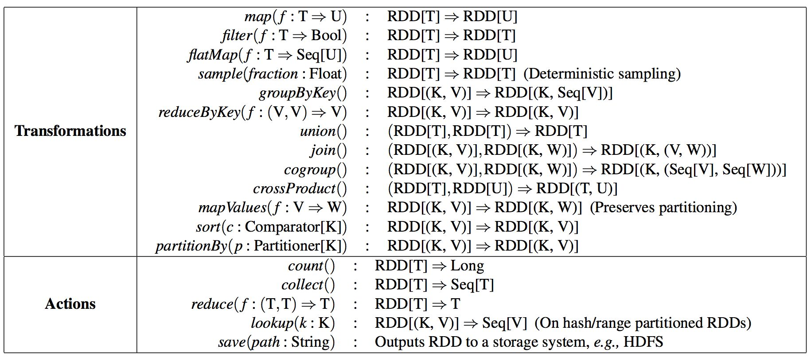
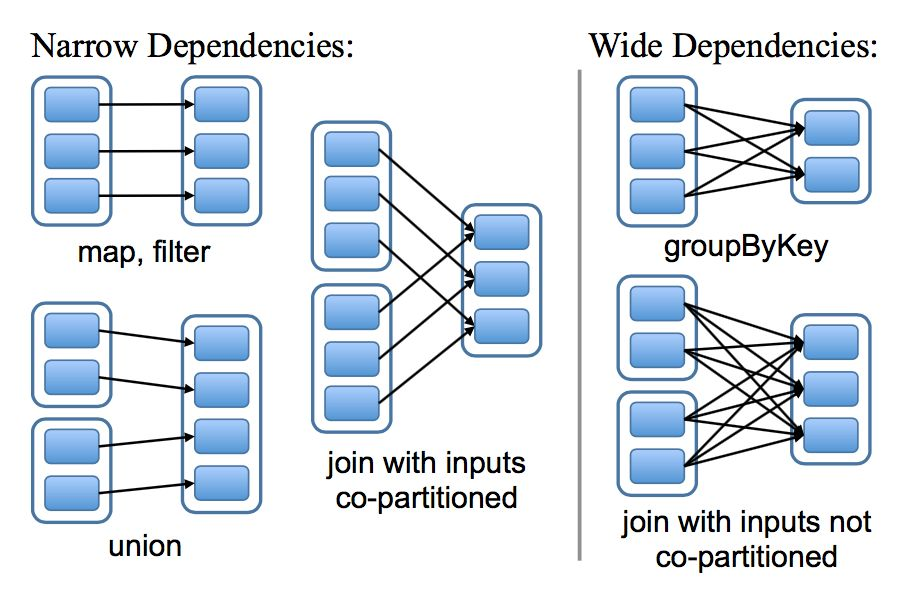
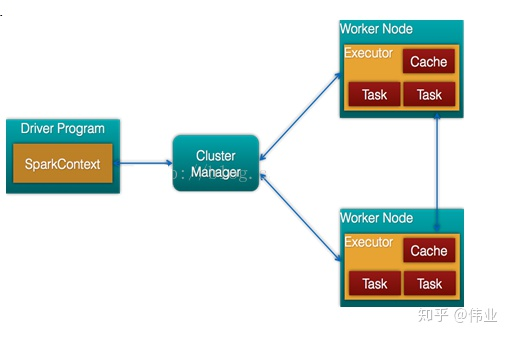
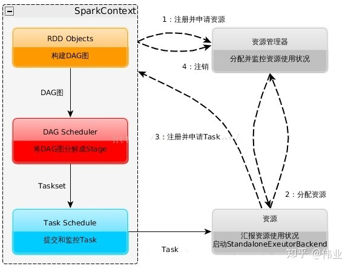
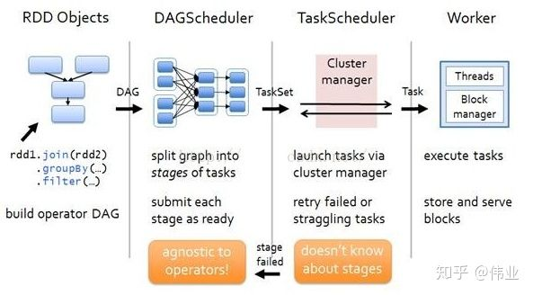
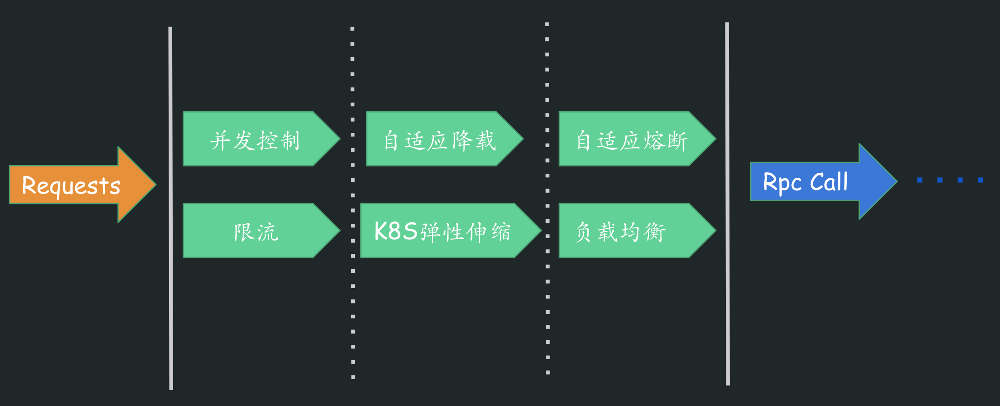
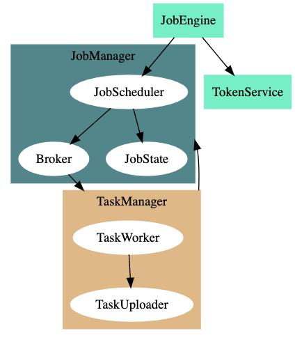
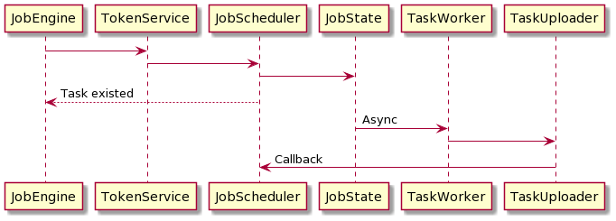

# FileX V3: 分布式文件处理

## 1. FileXV3 开发的背景

+ FileX 迁移到容器云 Luffy. Luffy 不能提供同等规格的容器实例( 24 核, 12 块 * 3 T) .
+ FileX 支持分布式运行, 可以通过扩容提高服务能力.

## 2. 常见的分布式程序

|                    | Example                   | 定位            | 场景及要解决的问题                                           | 节点通信         |
| ------------------ | ------------------------- | --------------- | ------------------------------------------------------------ | ---------------- |
| 消息队列           | Nsq, RocketMq, Kafka      | Message Queue   | 消息的传递的可靠性和高效性                                   |                  |
| 分布式任务队列     | machinery, gocelery       | Task queue      | It’s a task queue with focus on real-time processing, while also supporting task scheduling.<br />Task queues are used as a mechanism to distribute work across threads or machines. | Rabbit mq, Redis |
| 分布式任务调度系统 | airflow, 海豚调度, Flyte  | Workflows, DAG  | 时间依赖：任务需要等待某一个时间点触发。<br /> 外部系统依赖：任务依赖外部系统需要调用接口去访问。<br /> 任务间依赖：任务 A 需要在任务 B 完成后启动，两个任务互相间会产生影响。 <br />资源环境依赖：任务消耗资源非常多， 或者只能在特定的机器上执行。 | 封装的 Celery    |
| 分布式框架         | go-kit, go macro, go zero | Microservices   | 高并发服务                                                   | grpc             |
| 分布式计算引擎     | gleam, goSpark, GoSpark   | Big Data Angine | 大数据计算                                                   | Akka             |

### 2.1 分布式任务队列

**什么是任务队列?**

> Task queues are used as a mechanism to distribute work across threads or machines.
>
> A task queue’s input is a unit of work called a task. Dedicated worker processes constantly monitor task queues for new work to perform.
>
> Celery communicates via messages, usually using a broker to mediate between clients and workers. To initiate a task the client adds a message to the queue, the broker then delivers that message to a worker.
>
> A Celery system can consist of multiple workers and brokers, giving way to high availability and horizontal scaling

任务队列被用作跨线程或机器分发工作的机制。

任务队列的输入是称为任务的工作单元。专用工作进程不断监视任务队列，以执行新工作。

Celery 通过消息进行通信，通常使用代理在客户端和工人之间进行协调。为了启动一个任务，客户机将一条消息添加到队列中，然后代理将该消息传递给一个工作者。

芹菜系统可以由多个工作人员和中间商组成，从而实现高可用性和水平缩放

第三方异步任务框架: machinery, gocelery.

**gocelery**

gocelery 定位是 celery client, 主打能与 python celery 进行交互, 使用 go 编写 celery worker 提高性能. 这不符合当前需求 (FileX 没有 Python 代码), 而且能与 Python celery 互通也不稀奇 Node 和 PHP 也有对应的版本.

**machinery**

machinery 是用 Golang 语言实现了一遍 Python celery. 看完它的代码后, 认为它不该照搬 Python 的实现, Golang 实现的比较笨拙. 不用 grpc 而是利用 json 做序列化, 为了把数据传输给 worker 需要进行大量的类型转换. worker 接收后还做了大量的反射.

**架构**


### 2.2 分布式计算框架

**1) 梗概**

第三方分布式计算框架: gleam, goSpark, GoSpark

gleam 不支持压缩文件, gleam 的代码实现在 2w 行以上, 看了它处理文本的部分代码感觉它更适合做数据结果汇总而不是 ETL. (gleam 本身就是对 Spark 的借鉴)

goSpark 和 GoSpark 都是学生作业.

**2) Spark 的 RDD**

**RDD **

RDDs, Resilient Distributed Datasets

+ RDD 的容错机制为什么比分布式数据库高效?

 RDDs 提供了基于粗粒度转换（比如 map, filter 以及 join）的接口, 这些接口可以对多的数据条目应用相同的操作.这样就可以通过记录来生成某个数据集的一系列转换 （就是这个数据集 lineage）而不是记录真实的数据来达到提供高效的容错机制. 这个 RDD 就有足够的信息知道它是从哪 RDDs 转换计算来的, 如果一个 RDD 的分区数据丢失掉了, 那么重新计算这个 RDD 所依赖的那个 RDD 对应的区就行了. 因此可以很快且不用通过复制备份方式来恢复丢失的数据.

+ RDD 血缘及RDD 操作的分类



+ 宽依赖和窄依赖

宽依赖和窄依赖的概念背景: 表达出 RDDs 跟踪很多的 transformations 操作之间血缘关系.

Shuffle: 有些运算需要将各节点上的同一类数据汇集到某一节点进行计算，把这些分布在不同节点的数据按照一定的规则汇集到一起的过程称为 Shuffle。



参考链接:

+ [spark基本架构及原理](https://zhuanlan.zhihu.com/p/91143069)
+ [Apache Spark RDD 论文中文版 | ApacheCN](https://zhuanlan.zhihu.com/p/29517436)

**Spark 组成图:**

- Cluster Manager：在standalone模式中即为Master主节点，控制整个集群，监控worker。在YARN模式中为资源管理器
- Worker节点：从节点，负责控制计算节点，启动Executor或者Driver。
- Driver： 运行Application 的main()函数
- Executor：执行器，是为某个Application运行在worker node上的一个进程



**运行流程及特点:**

1. 构建Spark Application的运行环境，启动SparkContext
2. SparkContext向资源管理器（可以是Standalone，Mesos，Yarn）申请运行Executor资源，并启动StandaloneExecutorbackend，
3. Executor向SparkContext申请Task
4. SparkContext将应用程序分发给Executor
5. SparkContext构建成DAG图，将DAG图分解成Stage、将Taskset发送给Task Scheduler，最后由Task Scheduler将Task发送给Executor运行
6. Task在Executor上运行，运行完释放所有资源



**RDD在Spark中运行大概分为以下三步：**

1. 创建RDD对象
2. DAGScheduler模块介入运算，计算RDD之间的依赖关系，RDD之间的依赖关系就形成了DAG
3. 每一个Job被分为多个Stage。划分Stage的一个主要依据是当前计算因子的输入是否是确定的，如果是则将其分在同一个Stage，避免多个Stage之间的消息传递开销



### 2.3 分布式任务调度框架

链接: [awesome-workflow-engines](https://github.com/meirwah/awesome-workflow-engines)

分布式任务调度框架: airflow, 海豚调度. 

查看实例:

```
cd ~/mywork/airflow

/Users/yutou/Library/Python/3.7/bin/docker-compose up
```


### 2.4 分布式框架

侧重整体服务的可用性:



## 3 FileXV3

按域名和时间切割

根据日志量级, 1 个容器实例部署 1 个或多个域名; <br />对于像 v6 这种超大日志量的域名, 用小时数取模分实例部署.

抽象程度低<br /> 后续维护麻烦

  方案最简单, 代码改动量最小.

### 相关组件

+ JobEngine
+ TokenService
+ JobManager
  + JobScheduler
  + Broker: NsqAgent
  + JobState: Redis
+ TaskManager
  + TaskWorker
  + TaskUploader

### 组件关系图



### 时序图



## 附录

+ 架构图源码

```
digraph G {
  compound=true;
  
  subgraph clusterJobScheduler {
    color=cadetblue4;
    style=filled;
    node [style=filled,color=white];
    
    JobScheduler -> Broker;
    JobScheduler -> JobState;
    label=JobManager
  }
  
  
  subgraph clusterJobRunner {
    color=burlywood;
    style=filled;
    node [style=filled,color=white];
    TaskWorker -> TaskUploader;
    label=TaskManager
  }
  
  JobEngine [shape=box color=aquamarine2 style=filled];
  TokenService  [shape=box color=aquamarine2 style=filled];
  
  JobEngine -> TokenService;
  JobEngine -> JobScheduler;
  Broker -> TaskWorker[lhead=clusterJobRunner];
  TaskUploader -> JobScheduler[ltail=clusterJobRunner lhead=clusterJobScheduler];
  
}
```

+ 时序图

```
@startuml
JobEngine -> TokenService
TokenService -> JobScheduler
JobScheduler -> JobState
JobScheduler --> JobEngine: Task existed
JobState -> TaskWorker: Async
TaskWorker -> TaskUploader
TaskUploader -> JobScheduler: Callback
@enduml
```


