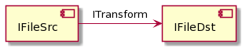
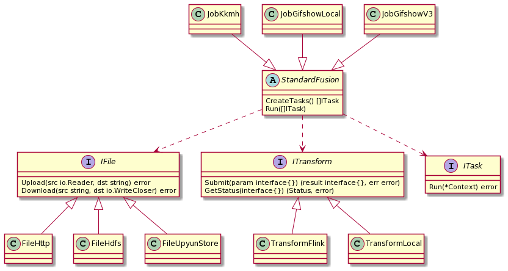

## FileX

FileX 是文件 ETL 工具. 目前已支持 UpyunStore/HDFS/Http 等数据源之间的同步转化.

## Features

+ Filex 通过封装的抽象文件接口和文件转换接口, 理论上能够支持任意数据源之间的数据同步工作. 同时 Filex 支持插件, 能够方便的扩展新的数据源.
+ 使用 `logrus` 实现了 traceID.

## FileX 详细介绍 

### 一. FileX 2.0 概览



`IFileSrc` 是输入数据源的文件接口, ITransform 是文件转换的接口, IFileDst 是输出数据源的文件接口. `IFileSrc` 和 `IFileDst` 仅有业务逻辑上的区别, 它们使用的文件接口是一样的.

### 二. 框架设计

FileX 的实现是 OOP 风格的, 如果采用 Java 等对 OOP 支持良好的语言, 代码能更精简易懂.



+ JobKkmh, JobGifshowLocal, JobGifshowV3 是最上层的业务逻辑. 它们通过继承并重写 `StandardFusion` 部分方法实现业务需求.
+ StandardFusion 是中间层, 依赖于 `IFile` / `ITransform` 等抽象接口, 实现了数量众多的通用方法供上层业务挑选.
+ IFile 和 ITransform 分别对文件系统和转化进行了抽象.

### 三. 参考列表

FileX 从以下项目中汲取了思路和灵感.

+ 项目名称, 文档和最初的思路. => DataX
+ ITask 的 pipeline 思想. => 之前的一个内部框架
+ IFile 的接口设计 => "github.com/colinmarc/hdfs/v2", "github.com/upyun/go-sdk/v3/upyun"
+ Context 的思想和代码实现 => Gin

### 四. TODO

+ 参考 `gcelery` 项目, 将 Filex 实现分布式作业.
+ 结合 `gleam` 项目, 升级为一个分布式通用型的计算框架.

## 附录

### plantum

fileX2.png

```
@startuml

abstract StandardFusion {
  CreateTasks() []ITask 
  Run([]ITask)
}

interface IFile {
  Upload(src io.Reader, dst string) error
  Download(src string, dst io.WriteCloser) error
}

interface ITransform {
  	Submit(param interface{}) (result interface{}, err error)
	GetStatus(interface{}) (Status, error)
}

interface ITask {
  Run(*Context) error
}


class JobKkmh
class JobGifshowLocal
class JobGifshowV3

class TransformFlink
class TransformLocal

class FileHttp
class FileHdfs
class FileUpyunStore


StandardFusion ..> IFile
StandardFusion ..> ITransform
StandardFusion ..> ITask

JobKkmh -down-|> StandardFusion
JobGifshowLocal -down-|> StandardFusion
JobGifshowV3 -down-|> StandardFusion

TransformFlink -up-|> ITransform
TransformLocal -up-|> ITransform

FileHttp -up-|> IFile
FileHdfs -up-|> IFile
FileUpyunStore -up-|> IFile

@enduml
```

