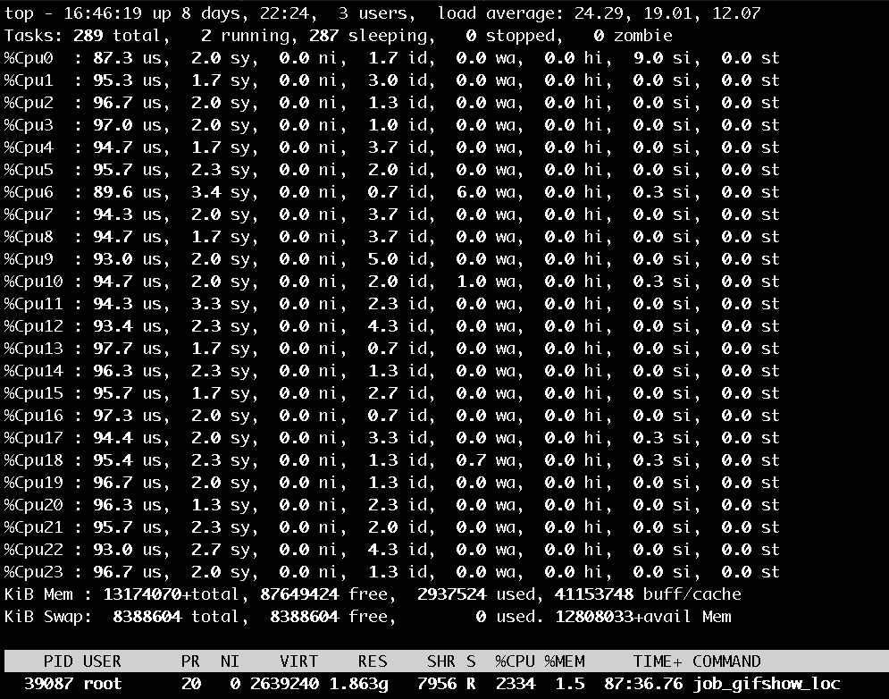

## 相关背景

系统上线后, 发现 CPU 一直跑满. 但是系统有大量的 IO 交互, 一直跑满比较可疑, 于是使用 pprof 进行分析.



*示意图: 24 核的机器跑满了, 基本都是用户态*

## 排查问题

### 1. 系统内已开启 pprof 的服务

开启 pprof 的服务, 参考: [1. 开启 pprof 服务](https://zhuanlan.zhihu.com/p/265080950) 

### 2. 采集 CPU 相关的数据

+ 系统需要安装 golang

+ 执行 pprof 命令, 采集 cpu 活动. (*注意, 要在 CPU 的使用高峰期进行采集, 不然生成的数据可能不够准确*)

```shell
// 9999 是我配置的 pprof 的端口
go tool pprof http://127.0.0.1:9999/debug/pprof/profile -seconds 10
```

这条命令会在当前路径下生成一个 `pprof` 的文件夹. `pprof` 内会有采集的压缩包, 压缩包的命名格式: `pprof.<compileName>.samples.cpu.001.pb.gz`

命令执行成功后, 会自动进行 `(pprof)` 的命令行, 在这个命令行内可以使用 `top`, `list` 等命令, 但是不够直观. 这个压缩包还可以生成页面.

### 3. 生成页面

服务器上没有浏览器, 把该压缩包下载到本地, 执行如下命令:

```shell
// 8088 是端口
// ./pprof.<compileName>.samples.cpu.001.pb.gz 是压缩包的本地路径
go tool pprof -http=:8088 ./pprof.<compileName>.samples.cpu.001.pb.gz
```

本地浏览器打开: `http:127.0.0.1:8088`

### 4. 分析数据

**4.1 各目录的作用**

在 view 栏有 Top, Graph, Flame Graph, Peek, Source, Disassemble 等子目录.

+ Top 是各个函数占用 CPU 的运行时间.
+ Graph 是函数的调用关系. 图中框的面积越大, 说明该函数越耗时.
+ Flame Graph 是火焰图. 火焰图的尖峰比较耗时.
+ Peek 和 Source 都是 Top 内容的细化, 分别以调用文件, 具体代码行的形式展现  CPU 耗时.

**4.2 当前系统的问题**

+ 从 TOP 和 Graph 看, "runtime.selectgo" CPU 耗时最高.
+ 从 Flame Graph 看, `runtime.lock` 和 `runtime.unlock` 的调用频繁.
+ 利用 Peek 查看文件的调用关系, 看系统的哪个文件在调用 `runtime/select.go` 文件

**4.3 有问题代码**

有问题的代码简化如下: 

```go
for {
  select {
   case <- channel1:
    // ...
   case <- channel2:
    // ...
   default:
    if <someCondition>:
    	return
  }
}
```

这段代码的问题是不该使用 `default`. 

`default` 是 `select` 的默认分支, 在 `case` 都不能匹配时执行 `default` 分支. 

`select` 外面嵌套了 for 循环, 如果没有 `default` , 本来循环会卡住, 这样会出让 CPU. 但是 `default` 的存在, 让每次的 for 循环都能快速执行, 这样就相当于写了死循环, 所以大量的 CPU 时间被浪费.

### 5 优化代码

```golang
for {
  select {
   case <- channel1:
    // ...
   case <- channel2:
    // ...
  }
   if <someCondition>:
    	return
}
```

**一个优化小技巧**

在代码中, 我基本不会直接用到 `for .. select` 的, 而是按照函数式编程的风格, 抽象了一个 `map` 方法, 然后业务层需要并发时去调用 `map`. 复用代码的好处是, 一旦底层代码出现问题非常容易查出来.

### 附录

+ 链接: [有问题的 pprof 文件](./pprof.job_gifshow_local.exe.samples.cpu.001.pb.gz)
+ 链接: [修复后的 pprof 文件](./pprof.job_gifshow_local.exe.samples.cpu.002.pb.gz)


